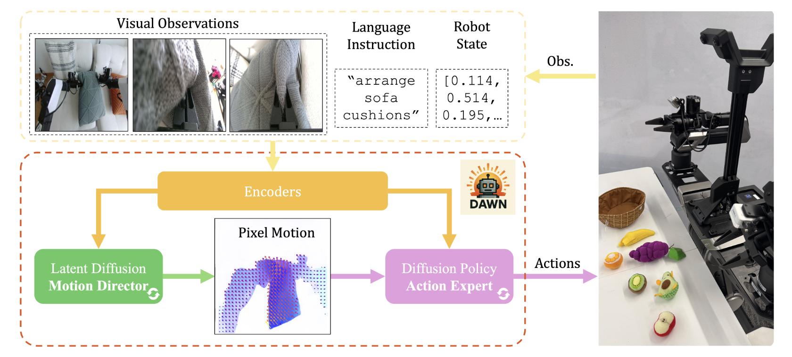

#   Pixel Motion Diffusion is What We Need for Robot Control

[E-Ro Nguyen*](https://eronguyen.me) [Yichi Zhang*](https://scholar.google.com/citations?user=HOCyXzsAAAAJ&hl), [Kanchana Ranasinghe](https://kahnchana.github.io/), [Xiang Li](https://xxli.me/), [Michael S Ryoo](http://michaelryoo.com)

Stony Brook University

\*Equal contribution

  

DAWN a unified diffusion-based framework for language-conditioned robotic manipulation that bridges high-level motion intent and low-level robot action via structured pixel motion representation.